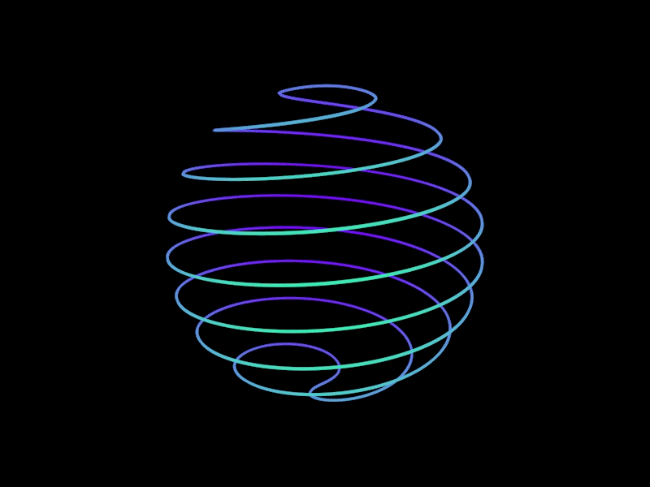

## Greetings Fellow Human 🖖 [Check out my Website Resume](https://raanaji.github.io/tanishq/)
###  Check out my [PDF Resume](https://github.com/Raanaji/tanishq/blob/7f9919cbe93de9b24a56d60ceef8d8187f9268e5/Tanishq-Chauhan_resume.pdf)

Hello, i'm Tanishq, a passionate quant with buy side and sell side investment experience based out of Dubai. My passion for quantitative finance is deep rooted in a luck-by-chance experience when I first came across a copy of "Fooled by Randomness" by Nassim Taleb at a bookstore during my 2nd year undergraduate. Since then, I have got two postguate qualifications in quantitative finance and have worked on several research projects involving use of quantitative methods. My main research was on application of copula models in Mortgage Backed Securities, and on alternative methods of quantifying risk in stochastic processes.

My personal interests lies in understanding of the universe as it is and mathematics is the surest way to reach the ultimate truth. I will be sharing my musings on the ideas of a mathematical universe on my blog.

Quiz: What could be common between the decay pattern of a uranium atom, the decline of societies, and the bicameralism of human consciousness?
Hint: You can refer to the market trading strategy of securing the downside, while the upside takes care of itself (survival long enough), this also is fundamental to the existence of religion

**Languages and Tools:**  
<code></code>
<code></code>
<code></code>
<code></code>
<code></code>
<code></code>
<code></code>
<code></code>

📈 my github stats

- 📋 Check out my Github Website, [Average Enjoyer](https://raanaji.github.io/average-enjoyer/)📈
- 📧 Any freelance work? do reach, [email](mailto:yosemite@californiamail.com)

