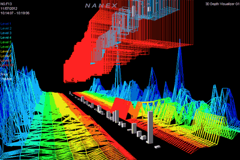

### Greetings 

 
Hello, i'm Tanishq, a passionate quant with buy side and sell side investment experience based out of Dubai. My passion for quantitative finance is deep rooted in a luck-by-chance experience when I first came across a copy of "Fooled by Randomness" by Nassim Taleb at a bookstore during my 2nd year undergraduate. Since then, I have got two postguate qualifications in quantitative finance and have worked on several research projects involving use of quantitative methods.

Being an adherent of the anti-fragile philosophy, I embrace entropy to an extent and am not riveted by challenges. My interests in quantitative finance lie in the understanding of complexity theory and its real life applications. 

- 📋 Check out my github pages, [githubpages]() :)
- 💼 any freelance work? do reach, [email](mailto:yosemite@californiamail.com) :)
- 💬 ask me about anything, i am happy to help;

**languages and tools:**  
<code></code>
<code></code>
<code></code>
<code></code>
<code></code>
<code></code>
<code></code>

📈 my github stats

 

